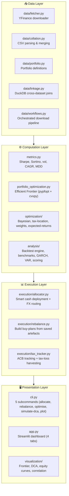

# PySharpe

> **Evidence-based portfolio optimization for Canadian investors.** Construct, compare, and validate long-term investment portfolios using modern financial research — with every recommendation traceable to published literature, transparent assumptions, and reproducible quantitative analysis.

---

## Mission

PySharpe is a portfolio research platform that **does not predict the market**. It mathematically manages risk, minimizes uncompensated drag, and optimizes for after-tax real wealth. Every model, constraint, and default parameter is grounded in published research and calibrated to the structural realities of Canadian retail investing — registered account types, foreign withholding tax treaties, CAD/USD conversion frictions, and CRA tax rules.

---

## The Evidence Canon

PySharpe organizes its optimization engine around a tiered evidence system. Higher tiers are opt-in and must demonstrably improve on the null hypothesis net of taxes, fees, and behavioral friction.

| Tier | Label | Behavior | Examples |
|------|-------|----------|----------|
| **0** | Null Hypothesis | Baselines. Any higher-tier recommendation must justify its divergence. | Market-cap indexing (`VEQT`, `XEQT`, `S&P 500`), equal-weight 1/N |
| **1** | Canonical | Default engine parameters. | Markowitz mean-variance, Sharpe ratio maximization, CRA superficial loss rules, basic asset location |
| **2** | Strong Evidence | Opt-in via CLI flags or config toggles. | Ledoit-Wolf covariance shrinkage, Bayes-Stein expected return shrinkage, Hierarchical Risk Parity, Purged/Embargoed cross-validation |
| **3** | Experimental | Sandboxed and flagged to the user. | LLM-generated active views for Black-Litterman, novel signal generation |

---

## Features

### 🇨🇦 Canadian Investor Toolchain

PySharpe is built from the ground up for the Canadian retail investor. It models the structural frictions that generic optimizers ignore:

- **2-D Asset Location Matrix** — Simultaneously solves both *what to hold* (asset allocation) and *where to hold it* (account placement) across TFSA, RRSP, FHSA, LIRA, RRIF, and Non-Registered accounts. Uses tax-adjusted expected returns that account for US foreign withholding tax (FWT) treaty protection, unrecoverable fund-level FWT on CAD-wrapped US ETFs, and account-specific income taxation.
- **Tax-Loss Harvesting (TLH) Engine** — Identifies unrealized capital losses, proposes switch-fund trades that maintain factor exposure, and enforces the CRA's 61-day superficial loss rule (ITA s. 54). Includes a full ACB tracker using the CRA-mandated weighted-average cost method.
- **Canadian ETF Benchmarks** — Built-in comparison against VEQT, XEQT, VGRO, XGRO, VBAL, and XBAL on equity curves and efficient frontier plots.

### 📊 Portfolio Optimization

- **Bayes-Stein Shrinkage** (default) — Shrinks individual expected returns toward the grand mean, directly countering recency bias. Data-driven shrinkage intensity with a configurable floor. *Jorion (1986).*
- **Ledoit-Wolf Covariance Shrinkage** — Regularized covariance estimation for improved out-of-sample stability. *Ledoit & Wolf (2004).*
- **Bayesian Posterior Estimation** — PyMC-based MCMC sampling of the full posterior distribution of asset returns and covariances. Compatible with Black-Litterman frameworks.
- **Efficient Frontier Optimization** — Max-Sharpe portfolio construction via PyPortfolioOpt, with support for MER caps, geographic exposure bounds, per-asset weight limits, and category grouping of correlated tickers.
- **Expected Return Models** — Choose from EMA, arithmetic mean, shrinkage (default), or constant-return (pure risk minimization).

### 🏦 Execution & Rebalancing

- **Smart Contribution Allocation** — Deploys new cash to assets that have drifted below target, blended with multi-factor valuation scores (P/E, P/B, dividend yield, momentum) and tax-efficiency.
- **Multi-Account Rebalancing** — Split contributions across TFSA/RRSP/Non-Reg proportionally, with per-account buy plans, tax-aware scoring, and contribution room tracking with automatic NON_REG spillover.
- **Whole-Share Rounding** — Floors recommended share counts to whole units, tracks leftover cash, and accounts for brokerage commissions and slippage.

### 🔬 Research & Analysis

- **Historical Backtesting** — Simulate portfolio performance with calendar (monthly/quarterly/annual), absolute drift-band, relative drift-band, and volatility-threshold rebalancing. Models transaction fees and slippage.
- **Walk-Forward Validation** — Rolling-window train/test evaluation with purged cross-validation support.
- **Time-Series Modeling** — ADF stationarity tests, GARCH volatility forecasting, and Vector Autoregression (VAR) for asset interdependency analysis.
- **Data Linkage (DuckDB)** — High-performance SQL window functions, rolling averages, lagged features, and macro-economic dataset joins via embedded DuckDB.
- **Head-to-Head Fund Comparison** — Side-by-side risk/return metrics (CAGR, volatility, drawdown, Sharpe, Sortino, Calmar, rolling tracking error, return correlation) for any two assets using the same data pipeline.
- **Proxy History Stitching** — Extend short-lived ETFs with longer proxy histories, with optional FX adjustment for cross-currency backfills.

### 🖥️ Interfaces

- **Streamlit Dashboard** — Interactive web UI with analytics, backtesting, DCA projections, efficient frontier visualization, and weight-tweak sliders.
- **CLI** — Scriptable `pysharpe optimise`, `rebalance`, `allocate`, `simulate-dca`, and `plot` subcommands.
- **Library API** — Fully importable Python modules for Jupyter notebooks and automated pipelines.

---

## Architecture

PySharpe follows a layered pipeline architecture — from data ingestion through computation and execution to presentation:



---

## Installation

PySharpe uses modular dependency groups:

```bash
# Core library (data + math, no visualization)
pip install -e .

# CLI tools (adds matplotlib, seaborn)
pip install -e .[cli]

# Web dashboard (adds streamlit, altair, plotly)
pip install -e .[gui]

# Everything
pip install -e .[all]

# Development (includes linters, test runners)
pip install -e .[dev]
```

Using `uv` (recommended):

```bash
uv pip install -e .[all]
```

---

## Quick Start

### 1. Optimize a portfolio

```bash
pysharpe optimise --portfolio demo --export-dir data/exports/
```

Produces `demo_weights.txt` (target allocations) and `demo_collated.csv` (historical prices).

### 2. Generate a buy plan

```bash
pysharpe rebalance \
  --portfolio demo \
  --holdings-json '{"AAPL": 2, "MSFT": 1}' \
  --new-cash 1000 \
  --export-dir data/exports/
```

PySharpe merges your holdings with the optimized targets, computes drift, scores opportunities, and prints exactly how many dollars and shares to buy.

### 3. Launch the dashboard

```bash
uv run streamlit run app.py
```

---

## Usage

### CLI

```bash
# Full optimization pipeline
pysharpe optimise \
  --portfolio my_portfolio \
  --export-dir data/exports/ \
  --return-model shrinkage \
  --shrinkage-floor 0.3 \
  --max-weight 0.20 \
  --base-currency CAD

# For small portfolios (≤ 4 assets), max-weight auto-adjusts if infeasible

# Rebalance with tax-aware multi-account support
pysharpe rebalance \
  --portfolio my_portfolio \
  --holdings-csv holdings.csv \
  --new-cash 5000 \
  --export-dir data/exports/

# DCA projection
pysharpe simulate-dca --months 240 --initial 10000 --monthly 500 --rate 0.07

# Smart cash allocation
pysharpe allocate --portfolio current_state.csv --amount 2000
```

### Streamlit Dashboard

The dashboard provides four tabs:

- **Analytics** — Metrics, optimized weights, efficient frontier with Canadian ETF benchmarks, and DCA projections.
- **Backtest** — Historical simulation with configurable rebalancing, fees, slippage, and benchmark overlays.
- **Data** — Raw price history and collated data inspection.
- **DCA** — Interactive dollar-cost averaging projections.

### Configuration

PySharpe auto-detects `portfolio_config.json` in the working directory. Example:

```json
{
  "mer_mapping": {
    "VFV.TO": 0.0009,
    "VCN.TO": 0.0005
  },
  "geo_mapping": {
    "VFV.TO": "US",
    "VCN.TO": "CA"
  },
  "constraints": {
    "max_portfolio_mer": 0.0015,
    "geo_upper_bounds": {"US": 0.60, "CA": 0.40},
    "geo_lower_bounds": {"US": 0.10}
  },
  "account_type": "TFSA",
  "allow_fractional": false,
  "fx_fee_bps": 150
}
```

### Library API

```python
import pandas as pd
from pysharpe import metrics
from pysharpe.analysis.comparison import compare_two_funds
from pysharpe.execution import build_rebalance_plan, format_rebalance_plan
from pysharpe.optimization import (
    TaxProfile,
    AssetTaxCharacteristics,
    AssetLocationEngine,
    SharpeOptimizer,
    SharpeOptimizerConfig,
)
from pysharpe.optimization.expected_returns import shrinkage_expected_return

# Compute metrics
prices = pd.read_csv("my_prices.csv", index_col=0, parse_dates=True)
returns = metrics.compute_returns(prices)
sharpe = metrics.sharpe_ratio(returns)
sortino = metrics.sortino_ratio(returns)
cagr = metrics.cagr(prices.iloc[:, 0])
mdd = metrics.maximum_drawdown(prices.iloc[:, 0])
mdd_dur = metrics.max_drawdown_duration(prices.iloc[:, 0])
calmar = metrics.calmar_ratio(prices.iloc[:, 0])
te = metrics.tracking_error(returns.iloc[:, 0], returns.iloc[:, 1])

# Head-to-head fund comparison
comparison = compare_two_funds("VFV.TO", "QQC.TO", start_date="2020-01-01")
print(comparison)

# Shrinkage expected returns (default engine model)
mu = shrinkage_expected_return(prices, shrinkage_floor=0.3)

# Canadian tax-aware optimization
profile = TaxProfile(marginal_tax_rate=0.45)
voo = AssetTaxCharacteristics("VOO", dividend_yield=0.013, is_us_domiciled=True)
engine = AssetLocationEngine(profile)
fwt_drag = engine.compute_fwt_drag(voo, "TFSA")   # 0.00195
fwt_drag = engine.compute_fwt_drag(voo, "RRSP")    # 0.0 (treaty-protected)

# Rebalance plan from saved artefacts
plan = build_rebalance_plan(
    "demo",
    new_cash=5000,
    holdings_csv="holdings.csv",
    export_dir="data/exports/",
)
print(format_rebalance_plan(plan))
```

---

## Interpreting Results

### Portfolio Analytics
- **Sharpe Ratio** — Risk-adjusted return efficiency. Higher = better returns per unit of risk.
- **Annual Volatility** — Portfolio "bumpiness." Use to align with risk tolerance.
- **Expected Return** — By default, Bayes-Stein shrinkage pulls estimates toward the grand mean, reducing recency bias.

### Rebalancing Metrics
- **Drift (Underweight %)** — How far below target an asset sits. Higher drift = stronger buy signal.
- **Valuation Score (0–1)** — Multi-factor blend of P/E, P/B, dividend yield, and momentum.
- **Opportunity Score** — Configurable blend of drift, valuation, and tax-efficiency signals.
- **Tax-Efficiency Score (0–1)** — Account-specific score from the Asset Location Engine. US equities score higher in RRSP (treaty-protected) than TFSA.

---

## Contributing

1. Create an isolated environment: `uv pip install -e .[dev]`
2. Format and lint: `ruff format . && ruff check .`
3. Write or update tests for any behavioral change.
4. Document public APIs in docstrings and, where appropriate, in this README.

```bash
# Run the full test suite
uv run pytest
```

191 tests pass (as of current `HEAD`). The suite covers metrics, optimization, the 2-D asset location matrix, tax-location engine, TLH engine, FX routing, rebalancing, backtesting, and the Streamlit app.

---

## License

PySharpe is distributed under the MIT License. See [LICENSE](LICENSE) for details.
