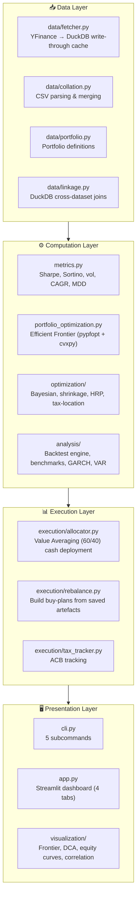

# PySharpe

> **Evidence-based portfolio optimization for Canadian investors.** Construct, compare, and validate long-term investment portfolios using modern financial research — with every recommendation traceable to published literature, transparent assumptions, and reproducible quantitative analysis.

<p align="center">
  <a href="https://github.com/janusson/PySharpe/actions/workflows/ci.yml"></a>
  <a href="https://github.com/janusson/PySharpe/actions/workflows/ci.yml"></a>
  <a href="https://github.com/janusson/PySharpe/actions/workflows/ci.yml"></a>
  <a href="https://github.com/janusson/PySharpe/blob/main/pyproject.toml"></a>
  <a href="https://github.com/janusson/PySharpe/blob/main/LICENSE"></a>
  <a href="https://github.com/janusson/PySharpe/blob/main/pyrightconfig.json"></a>
  <a href="https://docs.astral.sh/ruff/"></a>
  <a href="https://docs.astral.sh/uv/"></a>
</p>

---

PySharpe is a portfolio research platform that **does not predict the market**. It
mathematically manages risk, minimizes uncompensated drag, and optimizes for
after-tax real wealth. Every model, constraint, and default parameter is grounded
in published research and calibrated to the structural realities of Canadian
retail investing — registered account types, foreign withholding tax treaties,
CAD/USD conversion frictions, and CRA tax rules.

## Quickstart

```bash
# 1. Clone and install with uv (Python ≥ 3.12; exact versions locked in uv.lock)
git clone https://github.com/janusson/PySharpe.git
cd PySharpe
uv pip install -e ".[all]"

# 2. Launch the Streamlit dashboard — a 4-tab quantitative workspace
uv run streamlit run app.py

# 3. Or drive everything from the CLI
uv run pysharpe --help
```

The dashboard opens a stepwise workflow: **portfolio metrics & comparison vs. the
1/N equal-weight baseline**, the **efficient frontier** with the optimizer's
optimal weights, a **fully decoupled DCA simulator**, and **raw data & logs** —
with date boundaries derived automatically from the maximum overlapping price
history of your tickers. A complete walkthrough — portfolio definition →
optimization → buy plan — is in [Quick Start](#quick-start) below. Everything
from data download to rebalancing is reproducible with a locked dependency set
(`uv.lock`) and synthetic-data test suites.

---

## Engineering Rigor

PySharpe is built as production software, not a research notebook. Four
non-negotiable pillars guard every commit:

- **Strict typing** — [Pyright](https://microsoft.github.io/pyright/) in `standard`
  mode with **warnings promoted to fatal**: the suite holds **0 errors, 0 warnings**.
- **Ruff formatting** — [Ruff](https://docs.astral.sh/ruff/) is the *sole*
  formatter and linter (88-char, double-quote, import-sorted); CI fails on any drift.
- **uv dependency management** — [uv](https://docs.astral.sh/uv/) owns the
  environment; `uv sync --locked` in CI makes every build bit-reproducible from `uv.lock`.
- **DuckDB write-through caching** — every price download is cached behind
  DuckDB and invalidated by file `mtime`; stale data is impossible and repeat
  queries are SQL-fast.

The same discipline that guards the math guards the code:

| Guard | How it's enforced |
| ----- | ----------------- |
| **Strict typing** | [Pyright](https://microsoft.github.io/pyright/) runs on every PR in `standard` mode with **warnings promoted to fatal** (`pyright --warnings src/`) — the suite holds **0 errors, 0 warnings**. |
| **Lint & format** | [Ruff](https://docs.astral.sh/ruff/) is the sole linter *and* formatter (88-char, double-quote, import-sorted). CI fails on any drift. |
| **Dependency lock** | [uv](https://docs.astral.sh/uv/) manages the environment; `uv sync --locked` in CI means a build is bit-reproducible from `uv.lock`. |
| **DuckDB write-through cache** | Price downloads are cached behind DuckDB and invalidated by file `mtime` — stale data is impossible, and queries are SQL-fast. |
| **CI gate** | Three parallel jobs — `lint + typecheck`, `tests` with a **75% coverage floor**, and a **strict MkDocs build** (`--strict`: warnings are fatal). |
| **Test suite** | **990+ tests**, all synthetic data with fixed seeds — zero network calls, zero nondeterminism. PyMC samplers are isolated with `pytest.MonkeyPatch` so CI passes even without a C toolchain. |
| **Lookahead guardrails** | FX conversion *excludes* rows without rate coverage (never `.bfill()`), covariance estimators harden to strict positive-definiteness, and purged/embargoed CV enforces fold separation from the asset's own autocorrelation decay. |
| **Domain error contracts** | A dedicated exception hierarchy (`DataValidationError`, `DataIngestionError`, `ExecutionConfigError`) replaces raw stack traces with actionable messages. |
| **Self-documenting** | MkDocs Material site built from docstrings (griffe-parsed, `--strict`-clean), plus `docs/TEST_MAP.md` and `docs/GOTCHAS.md` that accumulate every failure pattern. |

## Signature Features

### 🇨🇦 2-D Asset Location Engine — *what* to hold, and *where* (TFSA vs RRSP vs Non-Reg)

Simultaneously solves the asset allocation **and** the account placement problem
across TFSA, RRSP, FHSA, LIRA, RRIF, and Non-Registered accounts. Tax-adjusted
expected returns account for US foreign withholding tax (FWT) treaty protection,
unrecoverable fund-level FWT on CAD-wrapped US ETFs, and account-specific income
taxation — so US equities land in the RRSP (treaty-protected) while Canadian
dividends stay in the TFSA and bonds are taxed last in Non-Registered.

### ⚖️ CRA Superficial Loss Guardrail & ACB Tracking

A compliance interlock that understands CRA rules, not just math:

- **Superficial loss enforcement** — a loss-sale in a Non-Registered account
  conflicts with *any* identical-property purchase in a sheltered account within
  ±30 days (same-day included). Identical-property maps cover S&P 500 pairs
  (VFV ↔ VOO ↔ SPY), NASDAQ-100, TSX 60, and more; violating buys are blocked and
  re-routed to the next-best non-identical asset.
- **ACB tracking** — CRA-mandated weighted-average cost method (ITA s. 47(1))
  with commission-adjusted cost bases and return-of-capital handling.

### 📉 Bayes-Stein Shrinkage — the default return model

Individual asset means are the noisiest inputs in portfolio theory. PySharpe's
default estimator shrinks every expected return toward the grand mean (Jorion
1986), directly countering recency bias — and pairs it with analytical
Ledoit-Wolf linear (2004) and nonlinear (2017/2020) covariance shrinkage,
eigen-clipped to strict positive-definiteness so solvers can never see a
singular matrix. The shrinkage intensity is data-driven: noisy, similar-looking
assets are shrunk more aggressively; genuinely different assets are shrunk
less. The same eigen-clip hardening applies to every downstream estimator,
including the opt-in Bayesian and Ledoit-Wolf models.

### 🧪 Combinatorial Purged Cross-Validation — test every path, not one

Single train/test splits cannot tell you whether a strategy's edge is real.
PySharpe implements Combinatorial Purged Cross-Validation (López de Prado 2018):
all valid training/test path combinations are evaluated, every fold is separated
by an embargo sized from the asset's own autocorrelation decay (never a fixed
guess), and results feed the Deflated Sharpe Ratio (with Lo's autocorrelation
adjustment) and Probability of Backtest Overfitting — so a claim of alpha must
survive the multiplicity of its own experiments.

### 🤖 `.agents/skills/` — the agentic development framework

The repository ships its own **modular context protocol for LLM coding agents**:
each domain owns a skill package (`pysharpe-allocation`, `pysharpe-optimization`,
`pysharpe-data-pipeline`, `pysharpe-backtesting`, `pysharpe-metrics`, …) encoding
that domain's architecture, guardrails, test maps, and *prohibitions*. Agents
load only the skills a task touches — so an allocation change cannot silently
violate the 60/40 VA scoring blend, and a data-pipeline change cannot reintroduce
`.bfill()` lookahead. The repo is engineered to be developed *by* AI agents as
rigorously as it is developed *for* investors.

### 🧮 The Quant Core

- **Value Averaging allocator** — deterministic, path-targeted contributions
  (60% path drift + 40% fundamental valuation/mean-reversion), not a black-box
  mean-variance solver.
- **Bayesian estimation** — PyMC posteriors (LKJ priors) feed a PyPortfolioOpt
  `EfficientFrontier` through the *posterior* covariance — never the sample —
  with a FAST_COMPILE fallback that keeps CI green without a C compiler.
- **Hierarchical Risk Parity** — inverse-variance-free diversification for
  ill-conditioned correlation structures, zero-variance-safe by construction.
- **Cost-realistic backtests** — bid-ask spread (half-spread per side),
  slippage, and per-order commissions at every rebalance, using only
  execution-date prices.

## The Evidence Canon

PySharpe organizes its optimization engine around a tiered evidence system.
Higher tiers are opt-in and must demonstrably improve on the null hypothesis
net of taxes, fees, and behavioral friction.

| Tier | Label | Behavior | Examples |
|------|-------|----------|----------|
| **0** | Null Hypothesis | Baselines. Any higher-tier recommendation must justify its divergence. | Market-cap indexing (`VEQT`, `XEQT`, `S&P 500`), equal-weight 1/N |
| **1** | Canonical | Default engine parameters. | Markowitz mean-variance, Sharpe ratio maximization, CRA superficial loss rules, basic asset location |
| **2** | Strong Evidence | Opt-in via CLI flags or config toggles. | Ledoit-Wolf covariance shrinkage, Bayes-Stein expected return shrinkage, Hierarchical Risk Parity, Purged/Embargoed cross-validation |
| **3** | Experimental | Sandboxed and flagged to the user. | LLM-generated active views for Black-Litterman, novel signal generation |

---

## Feature Catalog

### 📊 Portfolio Optimization

- **Bayes-Stein Shrinkage** (default) — Shrinks individual expected returns toward the grand mean, directly countering recency bias. *Jorion (1986).*
- **Ledoit-Wolf Covariance Shrinkage** — Analytical linear (2004) and nonlinear (2017/2020) estimators with strict positive-definiteness guarantees. *Ledoit & Wolf.*
- **Bayesian Posterior Estimation** — PyMC-based MCMC sampling of the full posterior distribution of asset returns and covariances. Compatible with Black-Litterman frameworks.
- **Efficient Frontier Optimization** — Max-Sharpe portfolio construction via PyPortfolioOpt, with MER caps, geographic exposure bounds, per-asset weight limits, and category grouping of correlated tickers.
- **Expected Return Models** — EMA, arithmetic mean, shrinkage (default), or constant-return (pure risk minimization).

### 🏦 Execution & Rebalancing

- **Smart Contribution Allocation** — Deploys new cash to assets that have drifted below target, blended with multi-factor valuation scores and tax-efficiency.
- **Multi-Account Rebalancing** — Split contributions across TFSA/RRSP/Non-Reg proportionally, with per-account buy plans, tax-aware scoring, and contribution room tracking with automatic NON_REG spillover.
- **Whole-Share Rounding** — Floors recommended share counts to whole units, tracks leftover cash, and accounts for brokerage commissions and slippage.

### 🔬 Research & Validation

- **Historical Backtesting** — Calendar, absolute drift-band, relative drift-band, and volatility-threshold rebalancing with bid-ask spread, slippage, and commission modeling.
- **Walk-Forward Validation** — Rolling train/test evaluation with purged cross-validation and autocorrelation-aware embargo sizing.
- **Overfitting Diagnostics** — Deflated Sharpe Ratio (with Lo's autocorrelation adjustment), Probability of Backtest Overfitting, effective-trials estimation.
- **Time-Series Modeling** — ADF stationarity tests, GARCH volatility forecasting, and VAR modeling.
- **Head-to-Head Fund Comparison** — Side-by-side risk/return metrics (CAGR, volatility, drawdown, Sharpe, Sortino, Calmar, rolling tracking error) for any two assets.
- **Proxy History Stitching** — Extend short-lived ETFs with longer proxy histories, with optional FX adjustment.

### 🖥️ Interfaces

- **Streamlit Dashboard** — 4-tab quantitative workspace: portfolio metrics &
  comparison vs. the 1/N equal-weight baseline, efficient frontier with optimal
  weights, a decoupled DCA simulator, and raw data & logs — plus backtesting,
  rebalancing, and weight-tweak sliders.
- **CLI** — Scriptable `pysharpe optimise`, `rebalance`, `allocate`, `simulate-dca`, and `plot` subcommands.
- **Library API** — Fully importable Python modules for Jupyter notebooks and automated pipelines.

---

## Architecture

PySharpe follows a layered pipeline architecture — from data ingestion through computation and execution to presentation:


```mermaid
flowchart TD
    subgraph Input["📥 Data Layer"]
        D1["data/fetcher.py
YFinance → DuckDB write-through cache"]
        D2["data/collation.py
CSV parsing & merging"]
        D3["data/portfolio.py
Portfolio definitions"]
        D4["data/linkage.py
DuckDB cross-dataset joins"]
    end

    subgraph Compute["⚙️ Computation Layer"]
        M["metrics.py
Sharpe, Sortino, vol, CAGR, MDD"]
        PO["portfolio_optimization.py
Efficient Frontier (pypfopt + cvxpy)"]
        OPT["optimization/
Bayesian, shrinkage, HRP, tax-location"]
        AN["analysis/
Backtest engine, benchmarks, GARCH, VAR"]
    end

    subgraph Execute["📊 Execution Layer"]
        AL["execution/allocator.py
Value Averaging (60/40) cash deployment"]
        RB["execution/rebalance.py
Build buy-plans from saved artefacts"]
        TX["execution/tax_tracker.py
ACB tracking"]
    end

    subgraph Present["🖥️ Presentation Layer"]
        CLI["cli.py
5 subcommands"]
        APP["app.py
Streamlit dashboard (4 tabs)"]
        VIZ["visualization/
Frontier, DCA, equity curves, correlation"]
    end

    Input --> Compute
    Compute --> Execute
    Execute --> Present
```

---

## Installation

PySharpe requires **Python ≥ 3.12** and is managed with [uv](https://docs.astral.sh/uv/):

```bash
# Core library (data + math, no visualization)
uv pip install -e .

# Everything: CLI + dashboard + development tooling
uv pip install -e ".[all]"

# Development (ruff, pyright, pytest, mkdocs) — from a git checkout, syncs the dev group
uv sync
```

`make` wraps the full developer workflow:

| Target | Action |
| ------ | ------ |
| `make install` | `uv sync` |
| `make lint` | ruff check + format check |
| `make typecheck` | pyright with warnings-as-errors |
| `make test` | pytest with coverage (fails below 75%) |
| `make check` | Full pre-commit gate: lint + typecheck + test |
| `make build_docs` | MkDocs strict build |

## Quick Start

> **Prerequisite:** [Install PySharpe](#installation) (`uv pip install -e ".[all]"`).

### 0. Create a portfolio definition

Create a CSV file in `data/portfolio/` listing your ETF tickers — one per line.
PySharpe is tuned for **broad-market CAD-denominated ETFs** (not single stocks).

```bash
# Example: a diversified all-equity Canadian portfolio
echo -e "VFV.TO\nVCN.TO\nVIU.TO\nVEE.TO\nVDY.TO" > data/portfolio/my_portfolio.csv
```

> 💡 Several example portfolios are already in `data/portfolio/` — try `cad_portfolio`
> or `canadian_etfs` to get started immediately.

### 1. Optimize the portfolio

```bash
uv run pysharpe optimise \
  --portfolio my_portfolio \
  --period 10y \
  --return-model shrinkage \
  --max-weight 0.25 \
  --base-currency CAD \
  --export-dir data/exports/
```

This downloads 10 years of daily prices (cached through DuckDB), converts USD
assets to CAD (no lookahead bias), estimates expected returns with Bayes-Stein
shrinkage, runs efficient-frontier optimization, and enforces constraints from
`portfolio_config.json` (MER caps, geographic bounds, TFSA account type).

### 2. Generate a buy plan

```bash
uv run pysharpe rebalance \
  --portfolio my_portfolio \
  --holdings-json '{"VFV.TO": 15000, "VCN.TO": 10000, "VIU.TO": 5000, "VEE.TO": 3000, "VDY.TO": 7000}' \
  --new-cash 2000 \
  --export-dir data/exports/
```

PySharpe computes your current weights vs. the optimized targets, scores
opportunities (60% path drift + 40% valuation/mean-reversion), and prints exactly
how many dollars and shares to buy — with whole-share rounding and tax-aware
account placement across TFSA/RRSP/Non-Registered accounts.

### 3. Launch the dashboard

```bash
uv run streamlit run app.py
```

Explore the efficient frontier, run historical backtests with Canadian ETF
benchmarks (VEQT, XEQT, VGRO, …), and iterate on weight tweaks interactively.

---

## Usage

### CLI

```bash
# Full optimization pipeline
uv run pysharpe optimise \
  --portfolio my_portfolio \
  --export-dir data/exports/ \
  --return-model shrinkage \
  --shrinkage-floor 0.3 \
  --max-weight 0.20 \
  --base-currency CAD

# Rebalance with tax-aware multi-account support
uv run pysharpe rebalance \
  --portfolio my_portfolio \
  --holdings-csv holdings.csv \
  --new-cash 5000 \
  --export-dir data/exports/

# DCA projection
uv run pysharpe simulate-dca --months 240 --initial 10000 --monthly 500 --rate 0.07

# Smart cash allocation
uv run pysharpe allocate --portfolio current_state.csv --amount 2000
```

### Streamlit Dashboard

The dashboard provides four tabs:

- **Analytics** — Metrics, optimized weights, efficient frontier with Canadian ETF benchmarks, and DCA projections.
- **Backtest** — Historical simulation with configurable rebalancing, fees, slippage, and benchmark overlays.
- **Data** — Raw price history and collated data inspection.
- **DCA** — Interactive dollar-cost averaging projections.

### Configuration

PySharpe auto-detects `portfolio_config.json` in the working directory. Example:

```json
{
  "mer_mapping": {
    "VFV.TO": 0.0009,
    "VCN.TO": 0.0005
  },
  "geo_mapping": {
    "VFV.TO": "US",
    "VCN.TO": "CA"
  },
  "constraints": {
    "max_portfolio_mer": 0.0015,
    "geo_upper_bounds": {"US": 0.60, "CA": 0.40},
    "geo_lower_bounds": {"US": 0.10}
  },
  "account_type": "TFSA",
  "allow_fractional": false,
  "fx_fee_bps": 150
}
```

### Library API

```python
import pandas as pd
from pysharpe import metrics
from pysharpe.optimization import (
    AssetLocationEngine,
    AssetTaxCharacteristics,
    TaxProfile,
)
from pysharpe.optimization.estimators import compute_nonlinear_shrinkage

# Metrics (stateless, vectorized)
prices = pd.read_csv("my_prices.csv", index_col=0, parse_dates=True)
returns = metrics.compute_returns(prices)
sharpe = metrics.sharpe_ratio(returns)

# Shrinkage covariance with strict positive-definiteness guarantees
cov = compute_nonlinear_shrinkage(returns)

# Canadian tax-aware optimization
profile = TaxProfile(marginal_tax_rate=0.45)
voo = AssetTaxCharacteristics("VOO", dividend_yield=0.013, is_us_domiciled=True)
engine = AssetLocationEngine(profile)
fwt_tfsa = engine.compute_fwt_drag(voo, "TFSA")  # 0.00195
fwt_rrsp = engine.compute_fwt_drag(voo, "RRSP")  # 0.0 (treaty-protected)
```

---

## Interpreting Results

### Portfolio Analytics
- **Sharpe Ratio** — Risk-adjusted return efficiency. Higher = better returns per unit of risk.
- **Annual Volatility** — Portfolio "bumpiness." Use to align with risk tolerance.
- **Expected Return** — By default, Bayes-Stein shrinkage pulls estimates toward the grand mean, reducing recency bias.

### Rebalancing Metrics
- **Drift (Underweight %)** — How far below target an asset sits. Higher drift = stronger buy signal.
- **Valuation Score (0–1)** — Multi-factor blend of P/E, P/B, dividend yield, and momentum.
- **Opportunity Score** — Configurable blend of drift, valuation, and tax-efficiency signals.
- **Tax-Efficiency Score (0–1)** — Account-specific score from the Asset Location Engine. US equities score higher in RRSP (treaty-protected) than TFSA.

---

## Contributing

1. Create an isolated environment: `uv sync`
2. Lint, format, and type-check: `make check`
3. Write or update tests for any behavioral change (synthetic data, fixed seeds).
4. Document public APIs in docstrings — the strict docs build parses every one.

```bash
# Run the full suite (990+ tests, no network calls)
uv run pytest
```

See `docs/TEST_MAP.md` for the test-to-module mapping and `docs/GOTCHAS.md` for
failure patterns that must never be reintroduced.

---

## License

PySharpe is distributed under the MIT License. See [LICENSE](LICENSE) for details.
