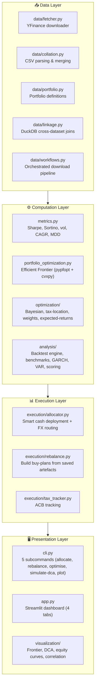

```mermaid
flowchart TD
    subgraph Input["📥 Data Layer"]
        D1["data/fetcher.py
YFinance downloader"]
        D2["data/collation.py
CSV parsing & merging"]
        D3["data/portfolio.py
Portfolio definitions"]
        D4["data/linkage.py
DuckDB cross-dataset joins"]
        D5["data/workflows.py
Orchestrated download pipeline"]
    end

    subgraph Compute["⚙️ Computation Layer"]
        M["metrics.py
Sharpe, Sortino, vol, CAGR, MDD"]
        PO["portfolio_optimization.py
Efficient Frontier (pypfopt + cvxpy)"]
        OPT["optimization/
Bayesian, tax-location, weights, expected-returns"]
        AN["analysis/
Backtest engine, benchmarks, GARCH, VAR, scoring"]
    end

    subgraph Execute["📊 Execution Layer"]
        AL["execution/allocator.py
Smart cash deployment + FX routing"]
        RB["execution/rebalance.py
Build buy-plans from saved artefacts"]
        TX["execution/tax_tracker.py
ACB tracking"]
    end

    subgraph Present["🖥️ Presentation Layer"]
        CLI["cli.py
5 subcommands (allocate, rebalance, optimise, simulate-dca, plot)"]
        APP["app.py
Streamlit dashboard (4 tabs)"]
        VIZ["visualization/
Frontier, DCA, equity curves, correlation"]
    end

    Input --> Compute
    Compute --> Execute
    Execute --> Present
```
