# PySharpe Architecture & Data Flow

```mermaid
flowchart TB
    %% ──────────────────────────────────────────────
    %% STYLE CLASSES
    %% ──────────────────────────────────────────────
    classDef dataLayer fill:#1a365d,stroke:#4299e1,color:#bee3f8
    classDef computeLayer fill:#1c4532,stroke:#68d391,color:#c6f6d5
    classDef execLayer fill:#5c3d1e,stroke:#f6ad55,color:#feebc8
    classDef presentLayer fill:#4a235a,stroke:#b794f4,color:#e9d8fd
    classDef guardrails fill:#742a2a,stroke:#fc8181,color:#fed7d7
    classDef experimental fill:#1a202c,stroke:#ecc94b,color:#fefcbf,stroke-dasharray: 5 5
    classDef future fill:#1a202c,stroke:#ecc94b,color:#fefcbf,stroke-dasharray: 2 4,opacity:0.7

    %% ═══════════════════════════════════════════════
    %% LAYER 0: CONFIGURATION & SETTINGS
    %% ═══════════════════════════════════════════════
    subgraph Config["🔧 Configuration Layer"]
        direction LR
        SETTINGS["config.py<br/>PySharpeSettings<br/>LRU-cached singleton"]
        PORTFOLIO_CFG["portfolio_config.json<br/>MER mapping · geo constraints<br/>account type · FX fees"]
        PROXY_MAP["proxy_map.json<br/>Ticker → proxy resolution<br/>FX & weight adjustments"]
    end

    %% ═══════════════════════════════════════════════
    %% LAYER 1: DATA PIPELINE
    %% ═══════════════════════════════════════════════
    subgraph DataLayer["📥 DATA PIPELINE"]
        direction TB

        subgraph Fetching["1. Fetching"]
            YFINANCE["YFinancePriceFetcher<br/>Live yfinance downloads"]
            DUCKDB["DuckDBCachedPriceFetcher<br/>Write-through cache<br/>data/cache/pysharpe_cache.db"]
            FX["apply_fx_conversion()<br/>CAD/USD FX adjustment<br/>⚠ NO .bfill()"]
        end

        subgraph Collation["2. Collation"]
            COLLATION["CollationService<br/>CSV parse · merge on Date<br/>→ data/exports/{name}_collated.csv<br/>⚠ mtime-aware LRU cache"]
        end

        subgraph Linkage["3. Linkage"]
            LINKAGE["DataLinker (DuckDB)<br/>SQL window functions<br/>lagged features · macro joins"]
            STITCH["Proxy history stitching<br/>Delisted→replacement chains<br/>cross-currency backfills"]
        end

        subgraph Portfolio["4. Portfolio IO"]
            PORT_CSV["data/portfolio/{name}.csv<br/>Portfolio definitions"]
            HOLDINGS["Holdings CSV / JSON<br/>Current positions"]
        end

        YFINANCE -->|"wrapped by"| DUCKDB
        DUCKDB -->|"price + currency"| FX
        FX -->|"CAD-adjusted prices"| COLLATION
        PORT_CSV --> COLLATION
        COLLATION -->|"collated DataFrame"| LINKAGE
        LINKAGE -->|"enriched data"| STITCH
    end

    %% ═══════════════════════════════════════════════
    %% LAYER 2: COMPUTATION ENGINE
    %% ═══════════════════════════════════════════════
    subgraph ComputeLayer["⚙️ COMPUTATION ENGINE"]
        direction TB

        subgraph CoreMetrics["Core Metrics (stateless)"]
            METRICS["metrics.py<br/>Sharpe · Sortino · Calmar<br/>CAGR · MaxDD · Tracking Error<br/>📐 Vectorized numpy/pandas only"]
        end

        subgraph Optimization["Portfolio Optimization"]
            direction LR
            subgraph StandardOpt["Standard Optimizer"]
                SHARPE_OPT["sharpe_optimizer.py<br/>EfficientFrontier (pypfopt)<br/>MER caps · geo bounds<br/>max_weight auto-relax"]
                EXPECTED_RET["expected_returns.py<br/>EMA · Mean · Shrinkage<br/>Constant-return (risk-min)"]
                WEIGHTS["weights.py + models.py<br/>PortfolioWeights<br/>OptimisationResult"]
            end
            subgraph AdvancedOpt["Advanced Optimizers"]
                BAYESIAN["bayesian.py<br/>PyMC MCMC posterior<br/>return & cov estimation"]
                BL["black_litterman.py<br/>Black-Litterman views"]
                HRP["hrp.py<br/>Hierarchical Risk Parity"]
                TAX_LOC["tax_location.py<br/>2-D Asset Location Matrix<br/>TFSA · RRSP · FHSA · LIRA<br/>FWT treaty protection"]
            end
            STANDARD_ORCH["portfolio_optimization.py<br/>optimise_portfolio()<br/>Collate → Optimize → Export artefacts"]
            STANDARD_ORCH --> StandardOpt
            STANDARD_ORCH --> AdvancedOpt
            StandardOpt --> WEIGHTS
            AdvancedOpt --> WEIGHTS
        end

        subgraph TimeSeries["Time-Series & Analysis"]
            TS["time_series.py<br/>ADF stationarity · GARCH volatility<br/>VAR modeling"]
            BENCHMARKS["benchmarks.py<br/>Canadian ETF baselines<br/>VEQT · XEQT · VGRO · VBAL"]
            COMPARISON["comparison.py<br/>Head-to-head fund comparison<br/>Stateless · no optimizer invoked"]
            CATEGORY["categorization.py<br/>Correlated ticker grouping"]
        end

        subgraph Backtesting["Backtesting Engine"]
            BACKTEST["backtest_engine.py<br/>Calendar rebalancing (M/Q/Y)<br/>Drift-band rebalancing<br/>Walk-forward optimization<br/>Transaction costs · slippage"]
            SCORING["scoring.py<br/>Strategy scoring<br/>Sharpe · drawdown penalty<br/>Multi-factor rank"]
        end
    end

    %% ═══════════════════════════════════════════════
    %% LAYER 3: EXECUTION
    %% ═══════════════════════════════════════════════
    subgraph ExecLayer["📊 EXECUTION LAYER"]
        direction LR

        subgraph Allocation["Value Averaging Allocator"]
            ALLOC_SCORE["score_opportunities()<br/>60% Path Drift<br/>+ 40% Valuation/Mean-Reversion<br/>⚠ 60/40 is authoritative<br/>+ Tax-efficiency (if differentiable)"]
            ALLOC_CONTRIB["allocate_contribution()<br/>Scores → Dollar amounts<br/>Min/max bounds enforced<br/>Budget constraint"]
        end

        subgraph Rebalance["Rebalancing"]
            REBALANCE["build_rebalance_plan()<br/>Load artefacts + holdings<br/>Compute drift & scores<br/>→ Buy amounts & share counts"]
            BROKERAGE["brokerage.py<br/>Whole-share rounding<br/>Commission & slippage<br/>Leftover cash tracking"]
        end

        subgraph Tax["Tax Tracking"]
            TAX_TRACK["tax_tracker.py<br/>ACB tracking (CRA method)<br/>⚠ TFSA: NO tax-loss harvesting<br/>FWT yield drag on US dividends"]
            CASH_FLOW["cash_flow_rebalance.py<br/>Multi-account contribution split<br/>TFSA/RRSP/Non-Reg routing<br/>NON_REG spillover"]
        end

        ALLOC_SCORE --> ALLOC_CONTRIB
        ALLOC_CONTRIB --> REBALANCE
        REBALANCE --> BROKERAGE
        BROKERAGE --> TAX_TRACK
        BROKERAGE --> CASH_FLOW
    end

    %% ═══════════════════════════════════════════════
    %% LAYER 4: VALIDATION & GUARDRAILS
    %% ═══════════════════════════════════════════════
    subgraph GuardLayer["🛡️ VALIDATION & GUARDRAILS"]
        direction LR
        VAL_METRICS["validation/metrics.py<br/>Statistical validation"]
        VAL_LEDGER["validation/ledger.py<br/>Transaction ledger integrity"]
        VAL_RESAMPLE["validation/resampling.py<br/>Purged CV · resampling"]
        VAL_SAMPLE["validation/sample_size.py<br/>Sample adequacy checks"]
        TAX_COMPLY["guardrails/tax_compliance.py<br/>CRA rule enforcement"]
        FRICTION["validation/friction.py<br/>Cost modeling validation"]
        PRE_COMMIT["Pre-commit checklist<br/>MER <.10 · no .bfill()<br/>mtime caches · income sum=1.0<br/>synthetic data only"]
    end

    %% ═══════════════════════════════════════════════
    %% LAYER 5: PRESENTATION
    %% ═══════════════════════════════════════════════
    subgraph PresentLayer["🖥️ PRESENTATION LAYER"]
        direction TB
        CLI["cli.py<br/>5 subcommands:<br/>· optimise · rebalance · allocate<br/>· simulate-dca · plot"]
        STREAMLIT["app.py<br/>Streamlit Dashboard<br/>4 tabs:<br/>· Analytics · Backtest<br/>· Data · DCA"]
        VIZ["visualization/<br/>frontier.py · dca.py<br/>equity_curve.py · correlation.py"]
        APP_MODULES["app/<br/>analytics.py · charts.py<br/>data.py · dca.py<br/>backtest.py · rebalance_ui.py"]
    end

    %% ═══════════════════════════════════════════════
    %% LAYER 6: EXPERIMENTAL & FUTURE
    %% ═══════════════════════════════════════════════
    subgraph Experimental["🔬 EXPERIMENTAL & FUTURE DIRECTIONS"]
        direction TB

        subgraph ActiveExp["Active Experiments (Tier 3)"]
            LLM_VIEWS["LLM-generated active views<br/>→ Black-Litterman inputs<br/>⚠ Sandboxed & flagged"]
            NOVEL_SIGNALS["Novel signal generation<br/>Alternative valuation factors<br/>⚠ Experimental tier only"]
            STRESS_BAYES["scripts/stress_test_bayesian.py<br/>Bayesian robustness testing"]
        end

        subgraph Planned["Planned / Aspirational"]
            P1["📋 Deployment automation<br/>Release tooling · PyPI publishing"]
            P2["📋 Expanded Jupyter notebooks<br/>End-to-end walkthroughs"]
            P3["📋 Morningstar/Fundata integration<br/>Additional data sources"]
            P4["📋 Monte Carlo retirement modeling<br/>Withdrawal rate simulations"]
            P5["📋 Multi-currency optimization<br/>Beyond CAD/USD"]
            P6["📋 Real-time rebalance alerts<br/>Drift threshold notifications"]
            P7["📋 PDF report generation<br/>Quarterly portfolio reports"]
        end

        subgraph ExplicitlyOutOfScope["🚫 Explicitly OUT OF SCOPE"]
            OOS1["❌ Predictive price ML"]
            OOS2["❌ Day-trading algorithms"]
            OOS3["❌ Gamified UI components"]
            OOS4["❌ Single-stock models"]
            OOS5["❌ Options pricing logic"]
            OOS6["❌ Tax-loss harvesting"]
            OOS7["❌ Sentiment analysis"]
        end
    end

    %% ═══════════════════════════════════════════════
    %% DATA FLOW CONNECTIONS
    %% ═══════════════════════════════════════════════

    %% Config feeds everything
    Config -.->|"settings"| DataLayer
    Config -.->|"settings"| ComputeLayer
    Config -.->|"settings"| ExecLayer

    %% Data → Compute
    PORT_CSV -->|"ticker list"| Optimization
    COLLATION -->|"collated prices"| Optimization
    LINKAGE -->|"enriched data"| TimeSeries
    STITCH -->|"extended histories"| Backtesting
    COLLATION -->|"prices"| TimeSeries
    COLLATION -->|"prices"| Backtesting

    %% Metrics used everywhere
    METRICS -.->|"called by"| Backtesting
    METRICS -.->|"called by"| TimeSeries
    METRICS -.->|"called by"| Allocation
    METRICS -.->|"called by"| Optimization
    METRICS -.->|"called by"| PresentLayer

    %% Compute → Execute
    Optimization -->|"target weights<br/>_weights.txt"| REBALANCE
    OPTIMIZATION -->|"collated prices<br/>_collated.csv"| REBALANCE
    Backtesting -->|"strategy validation"| Allocation
    TimeSeries -->|"volatility forecasts"| Allocation

    %% Execute → Guardrails
    Allocation --> GuardLayer
    REBALANCE --> GuardLayer
    TAX_TRACK --> GuardLayer

    %% Guardrails validate execution
    GuardLayer -.->|"validates"| ExecLayer

    %% Execute → Present
    REBALANCE -->|"buy plans"| CLI
    REBALANCE -->|"buy plans"| STREAMLIT
    Allocation -->|"opportunity scores"| CLI
    Optimization -->|"efficient frontier data"| VIZ
    Backtesting -->|"equity curves"| VIZ
    TimeSeries -->|"forecasts · ADF results"| VIZ
    COMPARISON -->|"comparison tables"| VIZ

    %% Orchestration workflows
    subgraph Workflows["🔁 Orchestration"]
        WF["workflows.py<br/>download_portfolios()<br/>optimise_portfolios()"]
        WF_MIL["scripts/unified_allocator.py<br/>End-to-end allocation run"]
        EXPORT["scripts/export_current_state.py<br/>Live prices + holdings → CSV"]
    end
    COLLATION --> WF
    WF --> Optimization
    COLLATION --> EXPORT
    EXPORT --> Allocation

    %% Experimental → Main engine
    LLM_VIEWS -.->|"opt-in"| BL
    NOVEL_SIGNALS -.->|"opt-in"| ALLOC_SCORE
    STRESS_BAYES -.->|"validates"| BAYESIAN

    %% ═══════════════════════════════════════════════
    %% APPLY STYLES
    %% ═══════════════════════════════════════════════
    class YFINANCE,DUCKDB,FX,COLLATION,LINKAGE,STITCH,PORT_CSV,HOLDINGS dataLayer
    class METRICS,SHARPE_OPT,EXPECTED_RET,WEIGHTS,STANDARD_ORCH,BAYESIAN,BL,HRP,TAX_LOC,TS,BENCHMARKS,COMPARISON,CATEGORY,BACKTEST,SCORING computeLayer
    class ALLOC_SCORE,ALLOC_CONTRIB,REBALANCE,BROKERAGE,TAX_TRACK,CASH_FLOW execLayer
    class CLI,STREAMLIT,VIZ,APP_MODULES presentLayer
    class VAL_METRICS,VAL_LEDGER,VAL_RESAMPLE,VAL_SAMPLE,TAX_COMPLY,FRICTION,PRE_COMMIT guardrails
    class LLM_VIEWS,NOVEL_SIGNALS,STRESS_BAYES experimental
    class P1,P2,P3,P4,P5,P6,P7 future
    class OOS1,OOS2,OOS3,OOS4,OOS5,OOS6,OOS7 future
```



---

## Layer Summary

| Layer | Purpose | Key Constraint |
|-------|---------|---------------|
| **Config** | Centralized settings, MER/geo constraints, proxy resolution | `get_settings()` is LRU-cached; clear in tests |
| **Data Pipeline** | yfinance → DuckDB cache → FX conversion → CSV collation → DuckDB linkage | No `.bfill()`; mtime-aware caches; DuckDB wraps only `YFinancePriceFetcher` |
| **Computation** | Metrics (stateless), optimization (pypfopt + PyMC), backtesting, time-series | Vectorized only; no heuristic approximations |
| **Execution** | Value Averaging allocator (60/40 blend), rebalancing, tax tracking, brokerage | No MPT solvers here; no TLH for TFSA |
| **Guardrails** | Validation, tax compliance, pre-commit checks | Confirms MER < 0.10, income fractions sum to 1.0, etc. |
| **Presentation** | CLI (5 subcommands) + Streamlit (4 tabs) + visualization | Streamlit is the primary UI |

## Evidence Tier System

```
Tier 0 (Null Hypothesis)  →  Market-cap indexing, VEQT/XEQT, equal-weight 1/N
Tier 1 (Canonical)        →  Markowitz MV, Sharpe max, CRA loss rules, asset location  ← DEFAULT
Tier 2 (Opt-in)           →  Ledoit-Wolf shrinkage, Bayes-Stein, HRP, purged CV
Tier 3 (Experimental)     →  LLM views for Black-Litterman, novel signal generation     ← SANDBOXED
```
